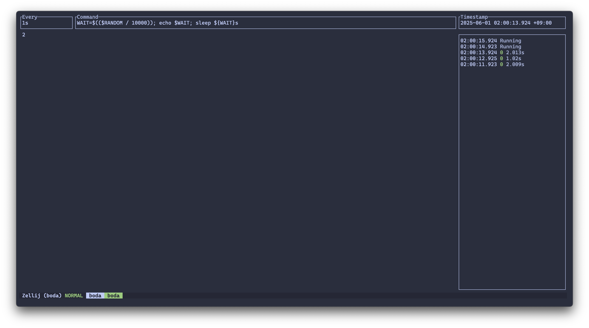

# Boda

**Boda** is an opinionated, Rust-based alternative to the classic Linux `watch` command.
The name *Boda* (보다) comes from the Korean verb meaning "to watch" or "to see."



## Feateures

- Navigate between historical outputs.
- Persist command output into a SQLite database.
- Run commands **concurrently**.

## Installation

### Using cargo

```bash
cargo install boda
```

### Using homebrew

```bash
brew install beleap/tap/boda
```

### From pre-built binary

Pre-built binary can be found at [release](https://github.com/BeLeap/boda/releases).

## Acknowledgement

- Heavily ispired by [viddy](https://github.com/sachaos/viddy)
